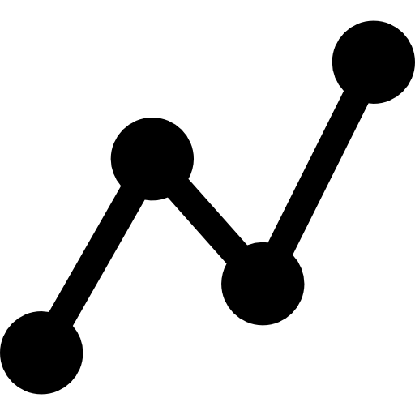

# CWC_GraphXY

## A Custom Web Control (CWC) to create a X/Y chart in WinCC Unified

Icon created by [Becris - Flaticon](https://www.flaticon.com/free-icons/graph")

Based on [chartJS](https://chartjs.org).

## ToDo:

- [x] Get request by customers
- [x] Find a timeslot
- [x] Write code
- [x] Debug
- [ ] Write documentation

## How to create a CWC from this stuff (skip if you just want to download the CWC):

1. Download/pull/whatever the code
2. cd in the **{1f718843-711b-4b43-b89d-44a58550ef43}** folder
3. Create **{1f718843-711b-4b43-b89d-44a58550ef43}.zip** file with the **{1f718843-711b-4b43-b89d-44a58550ef43}** folder content
> [!IMPORTANT]
> Do not include the **{1f718843-711b-4b43-b89d-44a58550ef43}** folder itself as root folder in the file zip!
4. Copy the **{1f718843-711b-4b43-b89d-44a58550ef43}.zip** file in **C:\Program Files\Siemens\Automation\Portal V1x\Data\Hmi\CustomControls** folder
5. Refresh the **My Controls** right side pane in the TIA Portal WinCC Unified screen editor
6. Enjoy

## How to directly download this CWC (if you are in a hurry):
1. Download from [here]({1f718843-711b-4b43-b89d-44a58550ef43}/build/{1f718843-711b-4b43-b89d-44a58550ef43}.zip)
2. Copy the **{1f718843-711b-4b43-b89d-44a58550ef43}.zip** file in **C:\Program Files\Siemens\Automation\Portal V1x\Data\Hmi\CustomControls** folder
3. Refresh the **My Controls** right side pane in the TIA Portal WinCC Unified screen editor
4. Enjoy

## May I have a TIA Portal project example?
Sure: just download it from [here]({1f718843-711b-4b43-b89d-44a58550ef43}/examples/TIAexample.zap19) (TIA V19)
The project needs the CWC to be installed before using (follow instructions above for downloading and installing)

## Documentation:

### How to use this?
This CWC (Custom Web Control) exposes several parameters (see the [manifest file]({1f718843-711b-4b43-b89d-44a58550ef43}/manifest.json) for details). All of them are dynamic, so you can assign static values in TIA Portal or dynamize them connecting tags, scripts, etc...

#### Xarray
A TIA Portal empty array you can populate with how much floats as you want. It defines the values on X axis.

#### Yarray
A TIA Portal empty array you can populate with how much floats as you want. It defines the values on Y axis.

#### Color
A TIA Portal color object (Alpha, R, G, B).

#### Label
This is the label shown in the legend of the chart. It's a string.

#### Thickness
This is the chart line thickness in pixels, so it's an integer.

#### PointSize
This is the chart points diameter in pixels, it's also an integer.

#### AnimationTime
This is the transition time for the chart animations, expressed in ms. To disable animations, just put a static 0 on this parameter.

#### Xmin and Xmax
These are the X axis limits (floats). To let chartJS chose limits for you, just put same values in both Xmin and Xmax, enabling autoscaling.

#### Ymin and Ymax
These are the Y axis limits (floats). To let chartJS chose limits for you, just put same values in both Ymin and Ymax, enabling autoscaling.

#### Xlabel and Ylabel
These are the axis labels (strings). Leave empty if you don't want labels on axis.

This CWC exposes a method too:

#### ForceRedraw
This just calls an update method on the chartJS object, with current configuration and dataset.

## May I ask for support on this CWC?
Sure: just drop me an [email](mailto:marco.buffa@siemens.com).